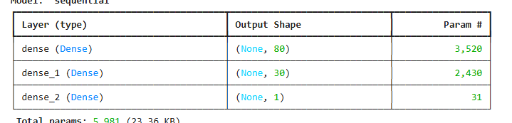

# deep-learning-challenge
---
repo:
---
    - AlphabetSoupCharity_Optimization.ipynb --notebook for building the models
    - Results_HDF5
        AlphabetSoupCharity1.h5 -- model 1 results
        AlphabetSoupCharity2.h5 -- model 2 results
        AlphabetSoupCharity3.h5 -- model 3 results
    - readme_files -- Resources for README.md

## Report on the performance of the deep learning model you created for Alphabet Soup.
---

### Overview: 
 - creating a binary classifier that can predict whether applicants for funding from Alphabet Soup will be successful.
---
---

## Data Need

- IS_SUCCESSFUL (y variable- labels )
- Features(X variable)
- The rest of the numerical columns in the DataFrame, minus the status EIN,NAME, and IS_SUCCESSFUL
---

- EIN and NAME removed from the input data because they are neither targets nor features.
---
- Compiling, Training, and Evaluating the Model

Used keras-tuner to check  what would be the optimize neural network model.
- Top three:

---

- Model 1( 1. From instruction in challenge.)

- Model 2 (2. Best from keras-tuner hyperparameters.)

- Model 3 (3. From second best keras-tuner hyperparameters.)

---

Were you able to achieve the target model performance?
- I was not able to achieve the target of 75% accuracy.
Best I could achieve was 73%  in Model 2 and Model 3.

Model 2 was less neurons than model 1 but was 1% higher accuracy. Model 3 was more layer then model 2 but accuracy are almost the same.(.04% difference).

Summary: With the results of the 3 models and the keras-tuner results, it seems that for the current preprocess data, there may be a cap of 73% accuracy. Maybe with preprocessing data that has a lower cutoff value for CLASSIFICATION, the accuracy might improve. 